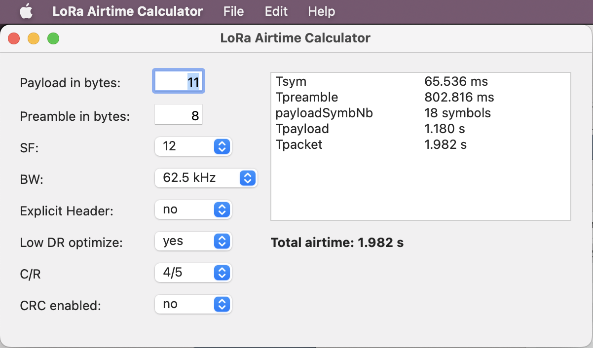
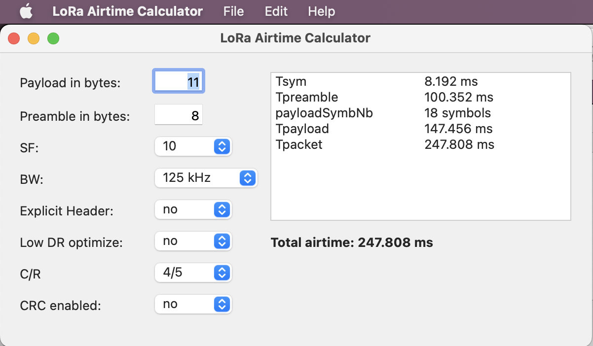
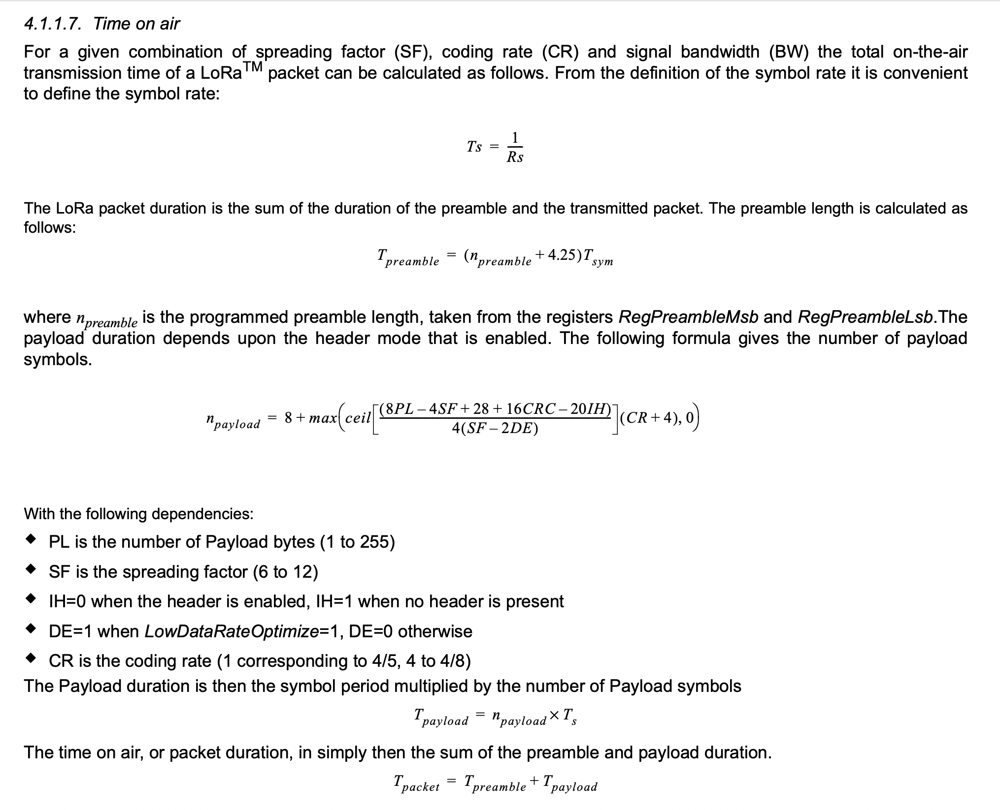

# LoRa Airtime Calculator

A simple app, made with [Xojo](http://www.xojo.com), that calculates the airtime of a LoRa packet, given all the settings of the LoRa module.

As you can see, these factors influence the airtime greatly. For those interested on the calculations, here it is, from the source, Semtech's datasheets.

